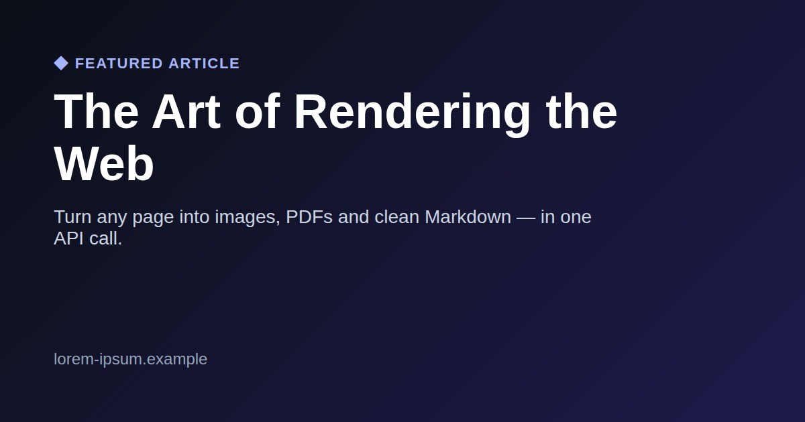
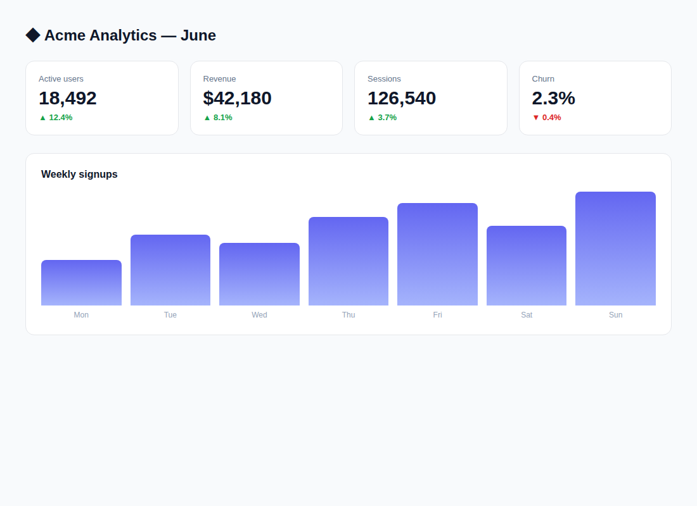
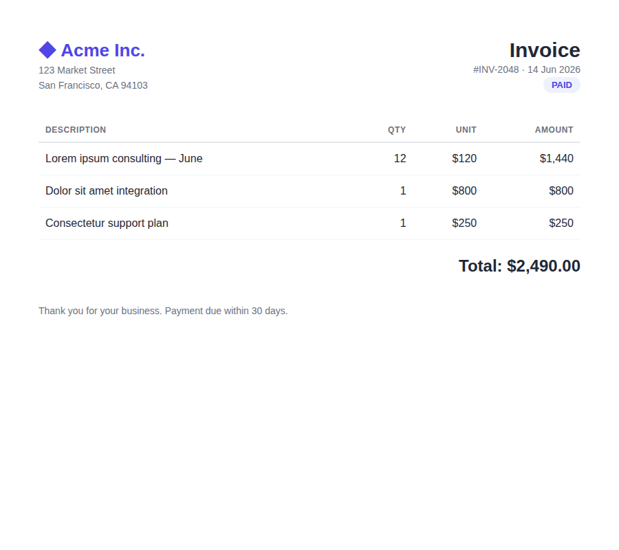

# snapforge-mcp

MCP server for **[SnapForge](https://snapforge.org)** — give your AI agents three tools to read and render the web:

- **`snapforge_screenshot`** — capture any URL or HTML as PNG/JPEG (full-page by default)
- **`snapforge_pdf`** — render a URL or HTML to PDF (`singlePage` option + clean pagination, no cut blocks)
- **`snapforge_markdown`** — extract clean **Markdown** from any page (article extraction) → perfect for feeding live web content to an LLM

Works with **Claude Code & Desktop, Cursor, Kilo Code, Cline, Windsurf, Zed, VS Code, Hermes, OpenClaw** — and any MCP client.

## Examples

Real outputs, generated live from the API:





More samples: [full-page screenshot (any height)](examples/screenshot-website-fullpage.png) · [pricing page](examples/screenshot-pricing.png) · [mobile viewport](examples/screenshot-mobile.png) · PDFs ([invoice](examples/invoice.pdf), [single-page article](examples/article-singlepage.pdf), [certificate](examples/certificate.pdf)) · [a page as Markdown](examples/article.md)

## Setup

Get a free API key at <https://snapforge.org> (100 one-time renders, no card), then:

### Hosted (zero install) — recommended
Point any MCP client at the remote server, with your key in the `x-api-key` header:

```
https://snapforge.org/mcp
```

### Local (stdio) — Claude Desktop / Claude Code / any client

```json
{
  "mcpServers": {
    "snapforge": {
      "command": "npx",
      "args": ["-y", "snapforge-mcp"],
      "env": { "SNAPFORGE_API_KEY": "sf_your_key" }
    }
  }
}
```

### Claude Code plugin (one-click)

```
/plugin marketplace add sporty303/snapforge-mcp
/plugin install snapforge@snapforge
```

## Environment
- `SNAPFORGE_API_KEY` (required)
- `SNAPFORGE_BASE_URL` (optional, defaults to `https://snapforge.org`)

## License
MIT
